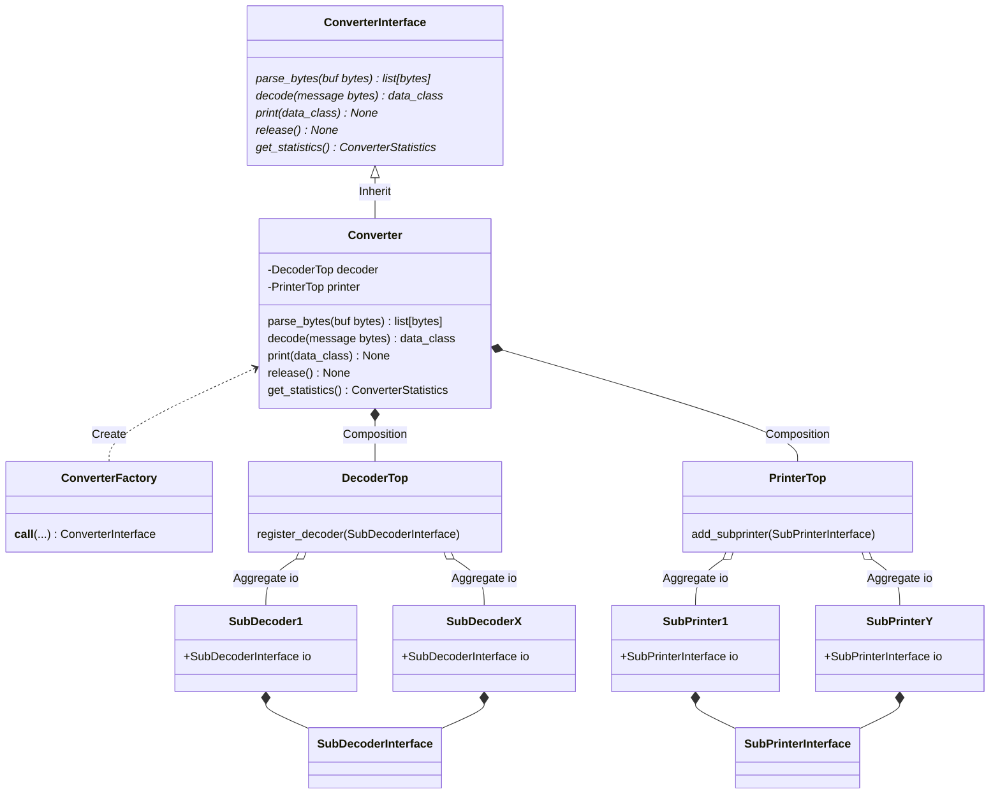

### Converter architecture

This class diagram represents a simplified architecture of RTCM converter. Some details are skipped to make it more readable.

```mermaid

classDiagram

class ConverterInterface
class Converter
class ConverterFactory
class DecoderTop
class PrinterTop
class SubDecoder1
class SubDecoderX
class SubPrinter1
class SubPrinterY

class SubDecoderInterface
class SubPrinterInterface


Converter *-- DecoderTop: Composition
Converter *-- PrinterTop: Composition
Converter: -DecoderTop decoder
Converter: -PrinterTop printer 
Converter: parse_bytes(buf bytes) list[bytes]
Converter: decode(message bytes) data_class
Converter: print(data_class) None
Converter: release() None
Converter: get_statistics() ConverterStatistics

Converter <.. ConverterFactory: Create

ConverterInterface <|-- Converter: Inherit
ConverterInterface: parse_bytes(buf bytes)* list[bytes]
ConverterInterface: decode(message bytes)* data_class
ConverterInterface: print(data_class)* None
ConverterInterface: release()* None
ConverterInterface: get_statistics()* ConverterStatistics

ConverterFactory: __call__(...) ConverterInterface

DecoderTop o-- SubDecoder1: Aggregate io
DecoderTop o-- SubDecoderX: Aggregate io 
PrinterTop o-- SubPrinter1: Aggregate io
PrinterTop o-- SubPrinterY: Aggregate io

SubDecoder1 *-- SubDecoderInterface
SubDecoderX *-- SubDecoderInterface
SubPrinter1 *-- SubPrinterInterface
SubPrinterY *-- SubPrinterInterface

SubDecoder1: +SubDecoderInterface io
SubDecoderX: +SubDecoderInterface io
DecoderTop: register_decoder(SubDecoderInterface)

SubPrinter1: +SubPrinterInterface io
SubPrinterY: +SubPrinterInterface io
PrinterTop: add_subprinter(SubPrinterInterface)


```