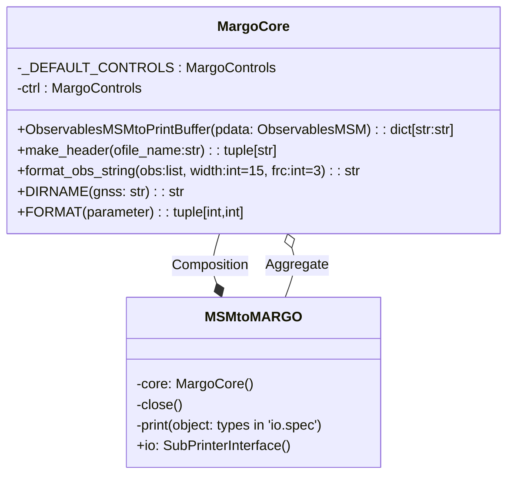

# Printer: MSM observables -> MARGO files

```mermaid

classDiagram

class MSMtoMARGO{


  -core: MargoCore()
  -close()
  -print(object: types in 'io.spec')
  +io: SubPrinterInterface()
}


class MargoCore{

  +ObservablesMSMtoPrintBuffer(pdata: ObservablesMSM) : dict[str:str]
  +make_header(ofile_name:str) : tuple[str]
  +format_obs_string(obs:list, width:int=15, frc:int=3) : str
  +DIRNAME(gnss: str) : str
  +FORMAT(parameter) : tuple[int,int]
  -_DEFAULT_CONTROLS : MargoControls 
  -ctrl : MargoControls
}

MargoCore --* MSMtoMARGO : Composition
MargoCore o-- MSMtoMARGO : Aggregate 

```