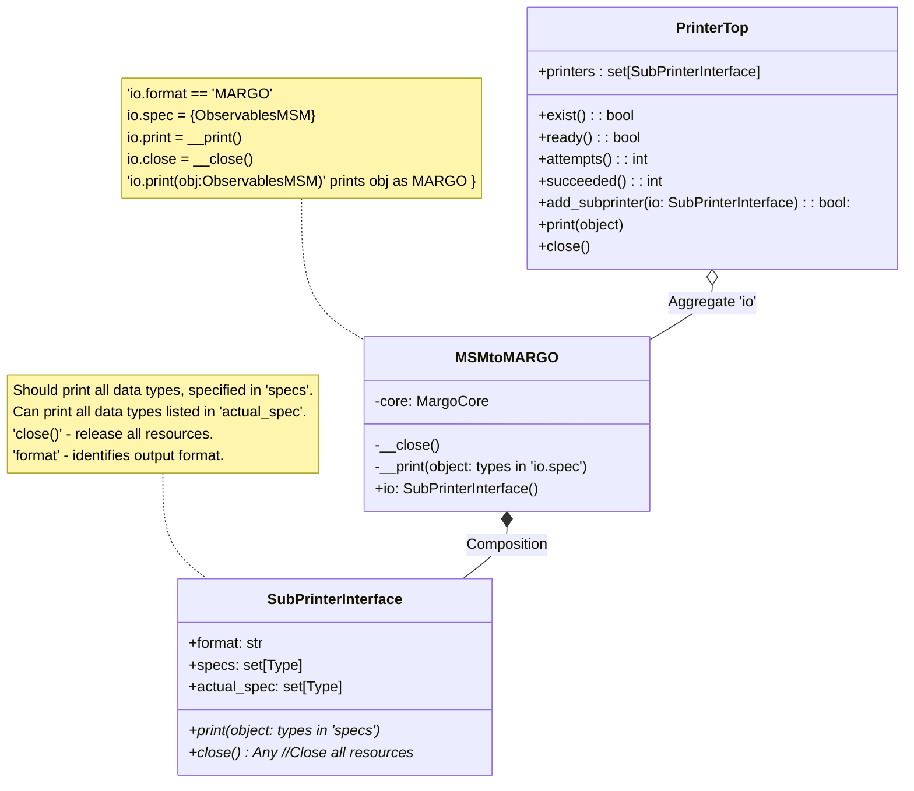

# TopLevelClassDiagram

```mermaid

classDiagram
  
  class PrinterTop{

  +printers : set[SubPrinterInterface]
  +exist() : bool
  +ready() : bool
  +attempts() : int
  +succeeded() : int
  +add_subprinter(io: SubPrinterInterface) : bool:
  +print(object)
  +close()
}

class SubPrinterInterface{

  +format: str
  +specs: set[Type]
  +actual_spec: set[Type]
  +print(object: types in 'specs')*
  +close()* Any //Close all resources
}

note for SubPrinterInterface "Should print all data types, specified in 'specs'.
Can print all data types listed in 'actual_spec'.
'close()' - release all resources.
'format' - identifies output format."

class MSMtoMARGO{

  -core: MargoCore
  -__close()
  -__print(object: types in 'io.spec')
  +io: SubPrinterInterface()
}

note for MSMtoMARGO " 'io.format == 'MARGO'
io.spec = {ObservablesMSM}
io.print = __print()
io.close = __close()
'io.print(obj:ObservablesMSM)' prints obj as MARGO }
"


MSMtoMARGO *-- SubPrinterInterface : Composition
PrinterTop o-- MSMtoMARGO : Aggregate 'io'


```

